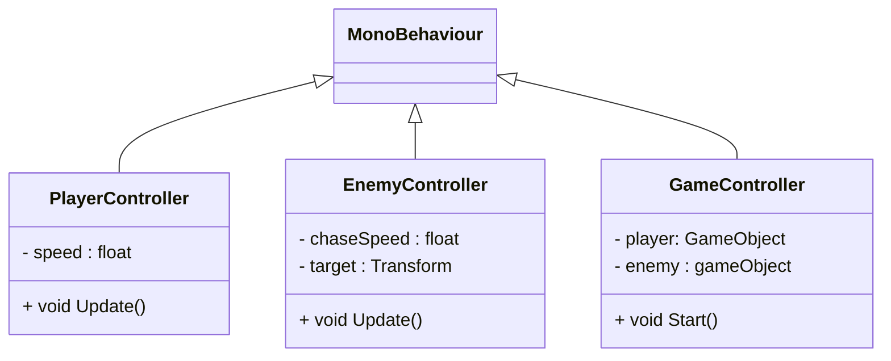

# 16-mermaid-mzaglmayr

```mermaid
classDiagram
    MonoBehaviour <|-- PlayerController
    MonoBehaviour <|-- EnemyController
    MonoBehaviour <|-- GameController
 
    class GameController {
        - player: GameObject
        - enemy : gameObject
        + void Start()
    }
    class PlayerController {
        - speed : float
        + void Update()
    }
 
    class EnemyController {
        - chaseSpeed : float
        - target : Transform
        + void Update()
    }
```
